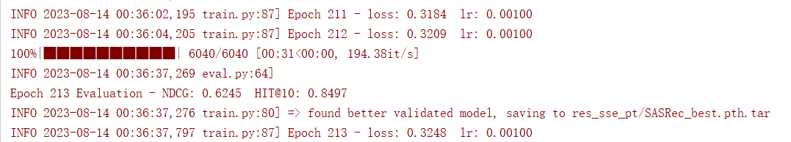
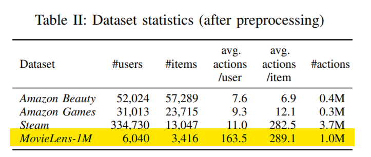

# SSE-PT.paddle
A PaddlePaddle implementation of Sequential Recommendation Via Personalized Transformer, an updated version of [SASRec model](https://arxiv.org/pdf/1808.09781.pdf ), with 

1. Stochastic Shared Embeddings layer added.
2. item embeddings are concatenated with their corresponding user embeddings.

This repo is basically an update of [SASRec.paddle](https://github.com/paddorch/SASRec.paddle ), and the README.md is also an modification of the original one.

Paper: [SSE-PT: Sequential Recommendation Via Personalized Transformer (acm.org)](https://dl.acm.org/doi/pdf/10.1145/3383313.3412258)

## Results

The results of this repo are reproduced on a GTX 1070. It takes about 10 minutes for the model to achieve the best results on MovieLens-1M, at about epoch 210.

This results is achieved by only setting the probability of replacing user embeddings to 0.1(with a probability of 0.1 to replace the user embeddings), with no replacement for item embeddings.



| Datasets     | Metrics | Paper's | Ours   | abs. improv. |
| ------------ | ------- | ------- | ------ | ------------ |
| MovieLens-1m | HIT@10  | 0.8351  | 0.8497 | 0.0146       |
| MovieLens-1m | NDCG@10 | 0.6174  | 0.6245 | 0.0071       |

## Requirement

```
tqdm>=4.51.0
paddlepaddle_gpu>=2.1.2
numpy>=1.20.3
```

- see `requirements.txt`

## Dataset



The users with less than 5 items are removed in the dataset provided by the author, as implemented in [SASRec.paddle](https://github.com/paddorch/SASRec.paddle ). The two columns are `user_id` and `item_id` respectively.

## Usage

### Train

```shell
bash train.sh
```

### Test

The model is evaluated at every `val_interval` batches while training and the training process is fast on MovieLens-1M, so you can also evaluate the model during training.

```shell
bash eval.sh
```

## Details

1. [inherited from as implemented in [SASRec.paddle](https://github.com/paddorch/SASRec.paddle ).] The original SASRec places `LayerNorm` before `MultiHeadAttention`, while it's moved after `MultiHeadAttention` in this repo. This arrangement achieved better results, and is accordance with the original `Transformer` model.
2. [inherited from as implemented in [SASRec.paddle](https://github.com/paddorch/SASRec.paddle ).] The original SASRec uses optimizer `Adam`, while this repo uses `AdamW` and achievement better results.
3. In this repo, The SSE replacement probability is defined slightly different from the original paper. The original SSE-PT take `p_u` as the probability of keeping the original embeddings, while this repo take it as the probability of replacing them with others, just like dropout rate. i.e., `p_u'=1-p_u`,  `p_u'`is the SSE replacement probability in this repo while `p_u` is that in the original paper.

## References

- implementations on github：

  - [SASRec.paddle](https://github.com/paddorch/SASRec.paddle )

  - [Original SSE-PT.Tensorflow](https://github.com/wuliwei9278/SSE-PT )

    

